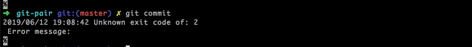
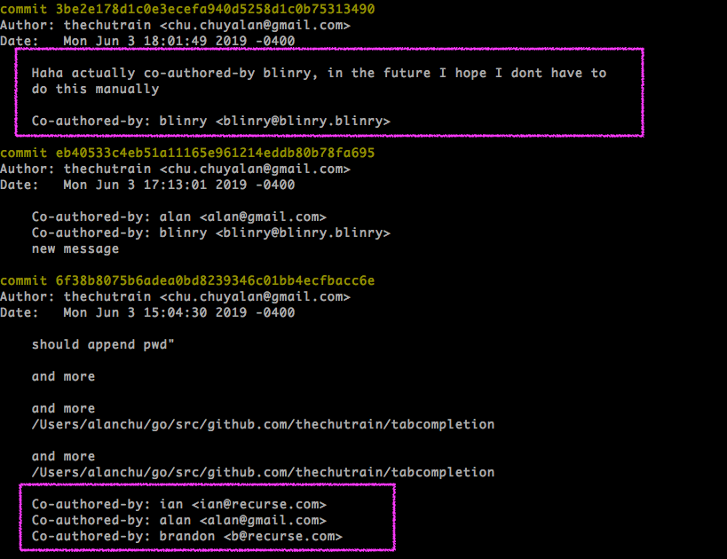

## Git-Pair 🍐🍐

---

## Background

- pairing at RC
- manually adding "Co-authored-by:" to credit others
- Gonazalo (Recurser) made [gonzalo/pair](https://github.com/gonzalo-bulnes/pair)

---

## Specs

- stores current pairs in `.git/config`
- uses `prepare-commit-msg` hook
- uses `urfave/cli` for autocompletion of cli cmds

---

## Demo

---

## Future Features

- alias for github names
- validating github names (http requests)
- autocomplete the `git pair add` command with previous collaborators
- ps1 variable output

---

## Fun Moments

#### Testing on the repo itself

---

## More Fun Moments

## 

---

## 🙏 Thanks

<ul>
  <li>Brandon</li>
  <li>Blinry</li>
  <li>Austin</li>
  <li>Nick</li>
  <li>Anushri</li>
  <li>Maren</li>
  <li>Ian</li>
</ul>

